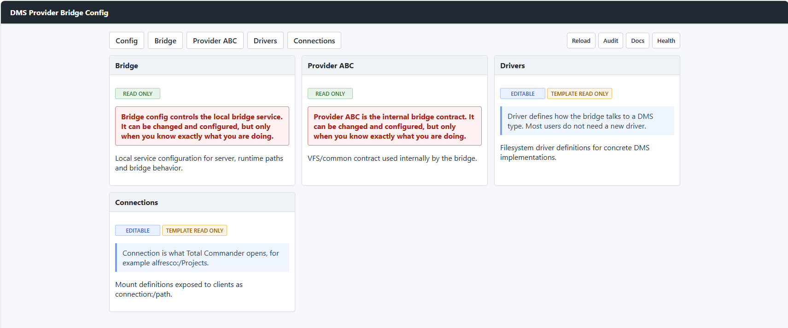
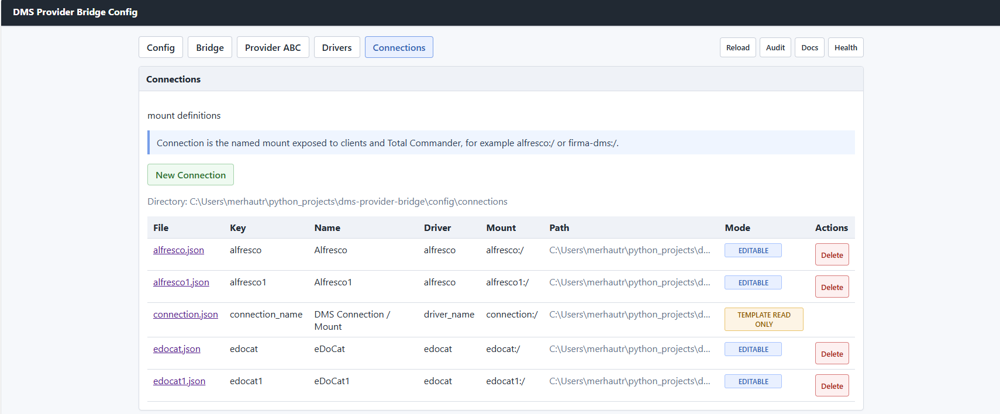
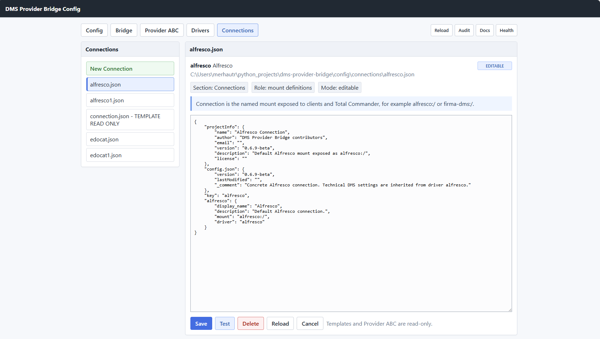
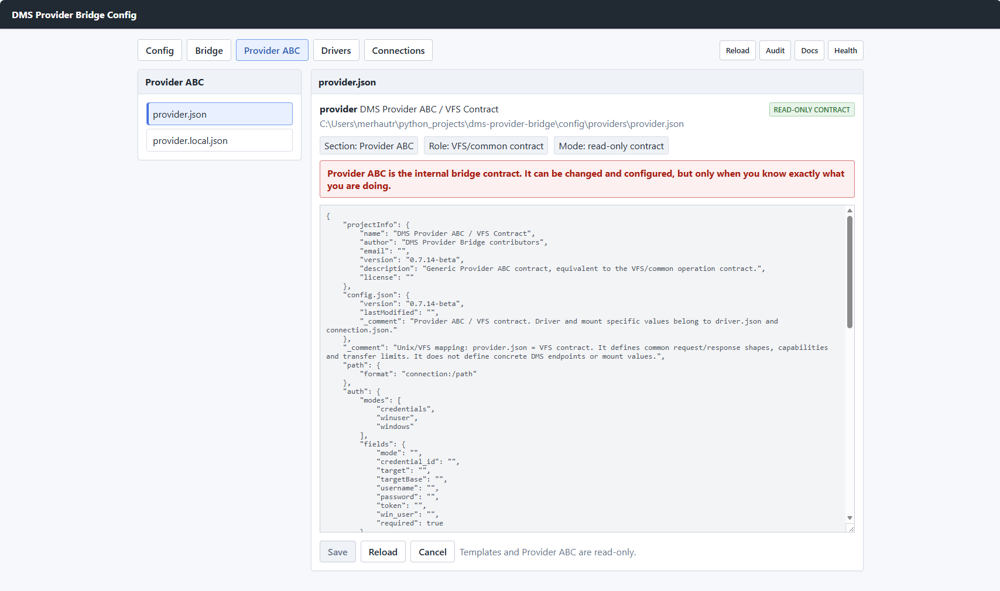
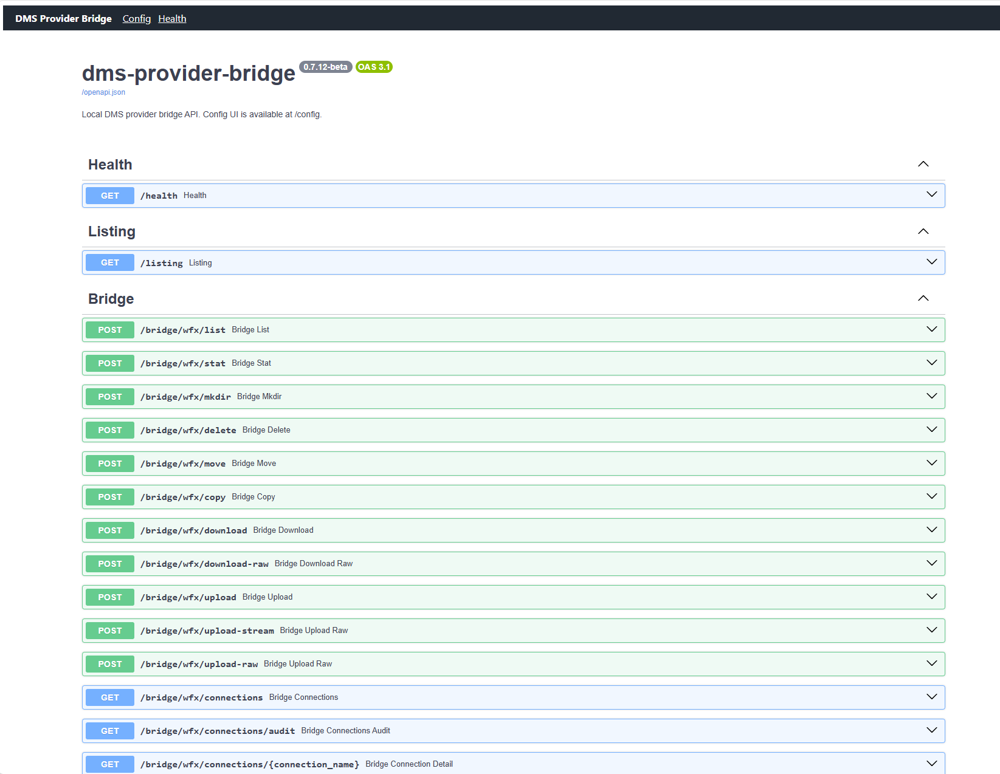

# dms-provider-bridge

[](https://github.com/mergi72/dms-provider-bridge/actions/workflows/ci.yml)
[](https://github.com/mergi72/dms-provider-bridge)
[](https://github.com/mergi72/dms-provider-bridge/releases/latest)
[](https://github.com/mergi72/dms-provider-bridge/releases/latest)

Current development branch: `develop`  
Stable release branch: `main`

`dms-provider-bridge` is a local TC VFS bridge for connecting Total Commander and API clients to DMS repositories through Auth, Drivers and Connections.

Current release mapping:

- Bridge repository latest changelog version: `1.1.5`
- Latest bridge-only release: `v1.1.5`

## Terminology and Compatibility

The bridge uses connection-first terminology without breaking the existing
WFX/API contract. Runtime code should use the new names while public
compatibility aliases stay available for older clients.

- `TC VFS Contract` for the internal bridge filesystem contract.
- `Driver` for concrete DMS implementations such as Alfresco, eDoCat and WebDAV.
- `Connection` for named mounts exposed to clients and Total Commander.
- Legacy `provider` aliases for backward compatibility.

The original 0.8 audit is kept as historical context in
[docs/terminology-audit-v0.8.md](docs/terminology-audit-v0.8.md).

## Configuration Model

Short version:

```text
Connection is the mount users open.
Driver is how the bridge talks to a DMS type.
TC VFS Contract is the shared filesystem contract underneath.
Its Python contract lives in `dms_provider_bridge.drivers.tc_vfs_contract.TcVfsContract`.
`dms_provider_bridge.drivers.base.Provider` remains as a temporary compatibility alias.
Auth is how identity is resolved for a connection.
```

The bridge configuration follows a simple VFS-style model:

- `TC VFS Contract` is the common bridge filesystem contract. It can be changed and configured, but only when you know exactly what you are doing.
- `Driver` describes one DMS type, for example Alfresco, eDoCat, WebDAV or another backend.
- `Connection` is the named mount exposed to clients and Total Commander, for example `alfresco:/` or `company-dms:/`.
- `Auth` resolves how a connection obtains credentials, tokens or anonymous access. Secrets are still owned by the Credential Broker / Windows Credential Manager.

Supported drivers in the current beta:

- `alfresco`
- `edocat`
- `webdav`

Bridge Configurator is available at [http://127.0.0.1:8765/config](http://127.0.0.1:8765/config).

The bridge now has two clearly separated responsibilities:

- Bridge runtime handles WFX/API operations such as list, upload, download, copy and move.
- Bridge Configurator handles configuration authoring, validation, runtime audit and connection tests.

The configurator currently runs inside the same local FastAPI process as the bridge, but it should be treated as an admin/configuration layer rather than as provider runtime logic.

## Screenshots

Bridge Configurator overview:



Connections list:



Connection detail:



TC VFS Contract view:



Bridge API / Swagger:



Runtime naming:

- WFX endpoints expose `connections`; old runtime `providers` naming is kept only as compatibility naming in the 0.9 beta API.
- Runtime connection names are connection keys/mounts from connection config.
- Driver modules such as `alfresco.py` and `edocat.py` remain the concrete DMS implementations behind those connections.
- Runtime discovery treats those modules as driver factories.
- `dms_provider_bridge.drivers` contains the concrete DMS driver implementations. `dms_provider_bridge.providers.*` remains as a compatibility wrapper for old imports.

Compatibility aliases:

- New request payloads should use `connection` or `connection_name` for the user-visible mount.
- Existing request payloads that still send `provider` or `provider_name` remain accepted as legacy aliases for `connection`.
- Responses and logs may include both `connection` and `provider` keys during the 0.9 beta series. `connection` is the preferred key; `provider` is kept for compatibility with existing tools and logs.
- Result models now expose `connection` next to legacy `provider`. When old driver code only sets `provider`, the bridge mirrors it into `connection`.
- When both names are supplied, they must point to the same value. A mismatch is treated as a validation/configuration error.
- `ProviderOperationError` is a compatibility alias for `ConnectionOperationError`.
- `load_provider_config()` and `list_provider_config_names()` are compatibility aliases for driver config loading.
- `provider_debug_logger()` and `log_provider_*()` are compatibility aliases for connection debug logging.
- `provider_service` is kept as a temporary import alias for `connection_runtime_service`.

Current UI rules:

- `tc-vfs-contract.json` is shown as the TC VFS Contract.
- `driver.json` and `connection.json` are templates and are shown as readonly.
- Concrete driver and connection files can be created and saved from the UI.
- Connection saves validate required driver and mount fields before writing JSON.
- The template files are never overwritten by `Save`.

Configuration checks:

- `Test` on a connection first performs a runtime-only check. It loads the connection, resolves its driver and shows the effective mount, base URL, auth mode and list endpoint. This check does not call the remote DMS.
- `Live List Root` is optional. It accepts the same auth JSON shape as Swagger requests, for example inline `username` and `password`, uses it for one request, and never writes it to config.
- `Audit` checks that every connection JSON is visible as a WFX connection and that runtime driver/mount values match the connection definition.
- Machine templates define the shape of config. User-specific or environment-specific values should be stored in local config files, not in the templates.

The 0.7 configuration/runtime model is intentionally split by responsibility:

```text
TC VFS Contract  read-only common filesystem contract
Driver        concrete DMS/API implementation settings
Connection    named mount exposed to clients as connection:/path
Auth          credential/token resolution layer used by connections and drivers
```

Auth responsibility:

```text
Connection
  says: this is the mount, driver, URL/root override and auth reference

Auth
  says: this connection uses none/basic/bearer/ticket credentials and this credential target/id

Broker / Windows Credential Manager
  says: here is the actual username/password/token secret

Driver
  receives resolved auth and only applies it to the upstream DMS request
```

Rules:

- Connection config may reference credentials, but must not store passwords or long-lived tokens.
- Multiple connections may share one credential target/id when they represent the same login identity.
- Drivers must not implement their own credential lookup logic.
- `AuthResolver` is the single bridge layer that merges driver defaults, connection overrides, `*.local.json` values and incoming WFX/API auth.
- Driver-specific code may still decide how to apply resolved auth, for example Alfresco ticket, HTTP Basic or HTTP Bearer.

## Runtime Modes

Bridge can be run in two different Windows runtime models. Keep them separate:

- TC user mode:
  - Intended for Total Commander / TC-WFX interactive usage.
  - Runs under the logged-in Windows user, for example from a user startup task.
  - Can access that user's Windows Credential Manager entries.
  - This is the right model for `credential_id` values created by the TC-WFX plugin.
- Service mode:
  - Intended for server-style local bridge usage.
  - Runs as the `DMSProviderBridge` Windows Service via NSSM.
  - Current setup installs the bridge service and preserves the installing user AppData path for configuration and logs.
  - `LocalSystem` cannot see credentials stored in an interactive user's Windows Credential Manager.

Current setup release `v1.1.5` is the Service mode installer with bootstrapper-based user AppData handling. TC user mode remains a separate runtime model for scenarios where user-scoped credentials are required.

## Connection Operations

The bridge supports file operations inside one connection and between different connections:

- Copy within the same connection uses the driver-native copy operation when available.
- Copy between connections, for example `edocat:/...` to `alfresco:/...`, is handled as download plus upload.
- Move between connections is handled as download, upload, then delete from the source connection.
- Large connection-to-connection transfers use a temporary file fallback when the payload exceeds the inline upload limit.

Connection-to-connection copy/move can use separate credentials for each side:

```json
{
  "source": "edocat:/source/file.txt",
  "destination": "alfresco:/target/file.txt",
  "auth": {
    "mode": "credentials",
    "credential_id": "fallback-credential"
  },
  "source_auth": {
    "mode": "credentials",
    "credential_id": "edocat-credential"
  },
  "destination_auth": {
    "mode": "credentials",
    "credential_id": "alfresco-credential"
  }
}
```

`source_auth` and `destination_auth` are optional. When omitted, the bridge falls back to `auth` for backward compatibility.

## WebDAV Driver

WebDAV is implemented as a generic driver because it is a standard filesystem-like HTTP protocol and maps naturally to the bridge TC VFS Contract. It is not an Alfresco or eDoCat special case.

Current operation mapping:

```text
TC VFS operation          WebDAV operation
list                      PROPFIND Depth: 1
stat                      PROPFIND Depth: 0
download                  GET
upload                    PUT
mkdir                     MKCOL
delete                    DELETE
copy                      COPY
move                      MOVE
```

Current scope:

- `config/drivers/webdav.json` defines generic WebDAV driver behavior.
- `config/connections/webdav.json` defines the default WebDAV mount.
- `list`, `stat`, `download`, `upload`, `mkdir`, `delete`, `copy` and `move` are implemented.
- Versioning, WebDAV locks, `PROPPATCH`, WebDAV Sync and server-specific extensions are intentionally outside the first beta implementation.
- Server behavior still depends on the concrete WebDAV backend. Some servers may restrict write operations, overwrite behavior, authentication schemes or path encoding.

Configuration shape:

```text
TC VFS Contract
  -> Driver: webdav
       -> Connection: webdav
       -> Connection: company_webdav
       -> Connection: nextcloud_test
```

The driver contains generic WebDAV behavior and defaults:

```json
{
  "key": "webdav",
  "webdav": {
    "display_name": "WebDAV",
    "tc_vfs_contract": "tc-vfs-contract",
    "api": {
      "base": "",
      "root": ""
    },
    "capabilities": {
      "versioning": {
        "supported": false
      },
      "stream": {
        "download": true,
        "upload": true,
        "copy": true
      }
    }
  }
}
```

The connection contains the concrete mount and target server:

```json
{
  "key": "webdav",
  "webdav": {
    "display_name": "WebDAV",
    "mount": "webdav:/",
    "driver": "webdav",
    "base_url": "https://example.org/webdav",
    "root_path": "/",
    "credentials": {
      "mode": "credentials",
      "credential_id": "",
      "target": "",
      "targetBase": "",
      "required": true
    }
  }
}
```

Testing notes:

- Prefer a disposable local or private WebDAV server for write tests.
- Public WebDAV endpoints should be treated only as smoke tests because they may reset, rate-limit, change authentication tokens or behave differently from real DMS-backed servers.
- Useful baseline tests are root listing, folder listing, upload/download small file, upload/download large file, create directory, rename, delete, copy and move.
- WebDAV does not provide DMS versioning by default. When copying from a versioned DMS connection to WebDAV, overwrite/cancel behavior is used instead of major/minor version prompts.

This driver is useful as a reference implementation because it proves that `TC VFS Contract -> Driver -> Connection` is not tied to Alfresco/eDoCat APIs.

## Related Projects

- `tc-wfx-plugin`
- `dms-provider-installer`

## Quick Start

```bash
python -m venv .venv312
.venv312\\Scripts\\activate
pip install -e .
python -m uvicorn dms_provider_bridge.app.server:app --host 127.0.0.1 --port 8765
```

Verify bridge:

- Health: [http://127.0.0.1:8765/health](http://127.0.0.1:8765/health)
- Swagger UI: [http://127.0.0.1:8765/docs](http://127.0.0.1:8765/docs)
- Config UI: [http://127.0.0.1:8765/config](http://127.0.0.1:8765/config)
- OpenAPI: [http://127.0.0.1:8765/openapi.json](http://127.0.0.1:8765/openapi.json)

The Swagger UI is the fastest way to:

- test connection connectivity
- test credentials
- browse connections
- validate request payloads before integrating clients

Standalone executable quick run:

```powershell
.\dist\dms-provider-bridge.exe
```

## Testing the Bridge

Use these endpoints first when diagnosing install/config/auth problems:

- Swagger UI: [http://127.0.0.1:8765/docs](http://127.0.0.1:8765/docs)
- OpenAPI: [http://127.0.0.1:8765/openapi.json](http://127.0.0.1:8765/openapi.json)
- Health: [http://127.0.0.1:8765/health](http://127.0.0.1:8765/health)

Most recent bridge issues were diagnosable directly through Swagger UI without adding debug code, including credential resolution, LocalSystem visibility, root path handling, and driver/connection config problems.

## VS Code (Windows)

The workspace is preconfigured to use the `.venv312` interpreter in `.vscode/settings.json`.

## Tests

Install test dependencies:

```bash
python -m pip install -e .[dev]
```

Quick run (PowerShell):

```powershell
.\scripts\run-tests.ps1 unit
.\scripts\run-tests.ps1 integration
.\scripts\run-tests.ps1 all
```

Quick run (Bash, for example Git Bash/WSL):

```bash
./scripts/run-tests.sh unit
./scripts/run-tests.sh integration
./scripts/run-tests.sh all
```

Note: both scripts look for the interpreter in this order: `.venv312`, `.venv`, and finally system `python`/`python3` from PATH.

## Clean Release ZIP (No Cache)

For release packaging, use Git archive so only tracked files are included:

```powershell
.\scripts\build-release-zip.ps1
```

This workflow automatically excludes local artifacts such as `__pycache__/`, `*.pyc`, `.venv/`, and runtime logs.

If you want to clean the local workspace before that, run:

```powershell
.\scripts\clean-artifacts.ps1
```

## Build bridge.exe (Windows)

For a release executable build (PyInstaller onefile), run:

```powershell
.\scripts\build-bridge.ps1
```

Output:

- `dist/dms-provider-bridge.exe`

Alternative build (onedir layout) is still available:

```powershell
.\scripts\build-bridge-exe.ps1
```

Quick health check:

```powershell
Invoke-RestMethod -Uri http://127.0.0.1:8765/health
```

## Safe Testing (ENV)

For local smoke testing, avoid hardcoded passwords in shell history. Put them into environment variables and build payloads from them.

PowerShell:

```powershell
$env:BRIDGE_USER = "user@domain"
$env:BRIDGE_PASSWORD = "secret"

$body = @{
  path = "alfresco:/"
  auth = @{
    mode = "credentials"
    username = $env:BRIDGE_USER
    password = $env:BRIDGE_PASSWORD
  }
} | ConvertTo-Json -Depth 10

Invoke-RestMethod -Method Post -Uri http://127.0.0.1:8765/bridge/wfx/list -ContentType "application/json" -Body $body
```

Bash:

```bash
export BRIDGE_USER='user@domain'
export BRIDGE_PASSWORD='secret'

curl -sS http://127.0.0.1:8765/bridge/wfx/list \
  -H 'Content-Type: application/json' \
  -d "{\"path\":\"alfresco:/\",\"auth\":{\"mode\":\"credentials\",\"username\":\"$BRIDGE_USER\",\"password\":\"$BRIDGE_PASSWORD\"}}"
```

## WFX Bridge API (for C# plugin)

## Config Layers

Configuration is loaded from two fixed Windows scopes:

- Installed config: `%APPDATA%\DMS Provider\config`
- Installed logs: `%APPDATA%\DMS Provider\logs`

The machine config is authoritative. For each config file, the bridge loads the machine JSON first, then merges the matching user `*.local.json` only if the machine JSON exists.

- Bridge/system config: `bridge.json`
- Driver config (`alfresco`, `sharepoint`, ...): `drivers/<driver>.json`
- Connection config (`company-dms`, `alfresco`, ...): `connections/<connection>.json`
- User overrides: `bridge.local.json`, `<driver>.local.json`, `drivers/<driver>.local.json`, `connections/<connection>.local.json`

User `*.local.json` values override existing machine keys and may add missing keys. If the machine JSON file is missing, the matching user `*.local.json` is ignored.
The tracked template files under `config/tc-vfs-contract`, `config/drivers` and `config/connections` define the machine-level contract and examples.

## First Working Driver Config

After installation, the bridge needs local driver values for the user's real DMS server. The installer cannot know these values.

For the simplest setup, put driver local files directly into:

```text
%APPDATA%\DMS Provider\config
```

Typical files:

```text
%APPDATA%\DMS Provider\config\alfresco.local.json
%APPDATA%\DMS Provider\config\edocat.local.json
```

Use the same top-level `key` and section name as the driver:

```json
{
  "key": "alfresco",
  "alfresco": {
    "base_url": "https://your-server.example.com/alfresco",
    "timeouts": {
      "requestSeconds": 60,
      "downloadSeconds": 300,
      "uploadSeconds": 7200
    }
  }
}
```

For eDoCat:

```json
{
  "key": "edocat",
  "edocat": {
    "base_url": "https://your-server.example.com",
    "credentials": {
      "targetBase": "company/eDoCat_Helper",
      "target": "user@example.com/eDoCat_Helper"
    }
  }
}
```

Rules:

- Do not edit `tc-vfs-contract.json` unless you are changing the internal TC VFS Contract.
- Do not overwrite `driver.json` or `connection.json` templates.
- Driver local config contains technical DMS settings such as `base_url`, timeouts and driver-specific defaults.
- Connection config contains the mount shown to clients, for example `alfresco:/` or `company-dms:/`.
- Credentials are not stored in these files. The TC plugin and Credential Broker handle saved credentials; Swagger can use inline `username` and `password` only for one test request.
- `credentials` / `auth` sections are references to the Auth layer. They may contain `mode`, `authScheme`, `credential_id`, `target` and `targetBase`, but not stored secrets.
- `targetBase` and `target` are Credential Broker / Windows Credential Manager target identifiers, not stored passwords.
- If two connections use the same login identity, they may share the same `credential_id` or `targetBase`.

After changing a local driver config:

1. Open [http://127.0.0.1:8765/config](http://127.0.0.1:8765/config).
2. Click `Reload`.
3. Open `Connections`.
4. Use `Test` for a configuration-only check.
5. Use `Live List Root` with temporary credentials to verify the remote DMS.
6. Open Total Commander and browse `\\DMS\<connection>`.

For local development, set `DMS_PROVIDER_MACHINE_CONFIG_DIR` and optionally `DMS_PROVIDER_USER_CONFIG_DIR` to test config directories.
The default connection comes from `connection.default` in `bridge.json`; `DMS_PROVIDER_DEFAULT_CONNECTION` can override it for local runs.
Runtime temporary files are written to `%TEMP%\DMS Provider` by default; set `DMS_PROVIDER_TEMP_DIR` only when a different temp root is required.

Debug logging is opt-in and uses the same `debug` object in `bridge.json` and driver/connection config files:

```json
{
  "debug": {
    "enable": true,
    "path": "%APPDATA%\\DMS Provider\\logs"
  }
}
```

When enabled in `bridge.json`, the bridge writes debug output to `bridge-debug.log` and runtime output to `bridge.log`.
When enabled in a driver or connection config, debug output goes to `<connection>-debug.log` or `<driver>-debug.log`, for example `alfresco-debug.log`.

Driver local config template:

```json
{
  "key": "sharepoint",
  "sharepoint": {
    "debug": {
      "enable": true,
      "path": "%APPDATA%\\DMS Provider\\logs"
    }
  }
}
```

Driver/connection implementations should use `connection_debug_logger(connection_name, config)` and the `log_connection_operation_start/done/failed` helpers from `dms_provider_bridge.core.debug` for operation-level diagnostics. Legacy `provider_debug_logger()` and `log_provider_operation_*()` helpers remain available as aliases. Config dumps are sanitized before logging sensitive keys such as passwords, tokens, secrets, and API keys.

Remote path format:

- `<connection>:/folder/file.txt`
- `alfresco:/folder/file.txt`

Endpoints:

The public client contract for file operations is `POST /bridge/wfx/*`. Legacy edit/transfer routes are not exposed in the web API; use `POST /bridge/wfx/delete`, `POST /bridge/wfx/move`, and `POST /bridge/wfx/copy` instead. `GET /listing` remains available as a quick diagnostic listing endpoint without the full WFX payload.

- `GET /bridge/wfx/connections` (connection discovery for root listing in the WFX plugin)
- `GET /bridge/wfx/connections/{connection_name}`
- `GET /bridge/wfx/connections/audit`

- `POST /bridge/wfx/list`
- `POST /bridge/wfx/stat`
- `POST /bridge/wfx/mkdir`
- `POST /bridge/wfx/delete`
- `POST /bridge/wfx/move`
- `POST /bridge/wfx/copy`
- `POST /bridge/wfx/download`
- `POST /bridge/wfx/download-raw`
- `POST /bridge/wfx/upload`
- `POST /bridge/wfx/upload-raw`
- `POST /bridge/wfx/upload-stream` (alias for `upload-raw`)
- `POST /bridge/wfx/resolve-share-url`
- `POST /bridge/wfx/browse-share-url`
- `POST /bridge/wfx/browse-share-url-validate`

Authentication (`auth`) is required for every call:

The bridge uses one incoming authentication model for all connections. Driver-specific credential lookup is handled by the Auth layer before the driver performs the upstream request.

- `credentials`:
  `{ "auth": { "mode": "credentials", "credential_id": "dms-prod" } }`
  or
  `{ "auth": { "mode": "credentials", "username": "user", "password": "secret" } }`

  `credential_id` is read from Windows Credential Manager. For regular credentials, use a generic credential with `UserName` and a secret in the credential blob; if the blob contains JSON, the bridge can also read `username`, `password`, `token`, and optional `base_url`.
- `winuser`:
  `{ "auth": { "mode": "winuser", "win_user": "DOMAIN\\user" } }`

Example request:

`{ "path": "alfresco:/", "auth": { "mode": "winuser", "win_user": "DOMAIN\\user" } }`

Response uses a unified shape:

- `ok` (`true/false`)
- `error_code` (`0` = OK)
- `message` (error text)
- `data` (operation payload)
- `metadata.connection` (active connection)
- `metadata.provider` (legacy alias for active connection)
- `metadata.upstream_auth_scheme` (for example `basic`, `ticket`)
- `metadata.upstream_endpoint` (actual upstream endpoint for the driver)

Execution mode notes:

- If the bridge obtains usable upstream credentials or ticket, operations run in `live` mode.
- If credentials or ticket are not available, the bridge returns a safe `preview` result (including exact endpoint) so the WFX layer can see what would be called.

Transfer operations:

- `download`: `{ "path": "alfresco:/contracts/sample.txt", "auth": { ... } }`
- `upload`: `{ "destination": "alfresco:/contracts", "file_name": "upload.txt", "content_base64": "...", "overwrite": true, "auth": { ... } }`
  - Intended only for small test payloads (`upload.inline.maxBytes`, default `4194304` = 4 MB).
  - For larger files use `upload-raw` / `upload-stream`.
- `upload-raw` / `upload-stream`: multipart form-data with fields `destination`, `file_name`, `overwrite`, `auth_json`, and binary field `file`

Raw upload limits:

- Config key: `upload.raw.maxBytes` in machine `bridge.json` (can be overridden by user `bridge.local.json`)
- Default: `536870912` (512 MB)
- Stream chunk size key: `upload.raw.chunkBytes` (clamped to 1-4 MB, default `1048576` = 1 MB)
- Bridge rejects larger payloads before driver upload and logs `bytes`, `max_bytes`, and `duration_ms`

Alfresco upload transport:

- Raw upload writes incoming multipart file to a temporary file in chunks (1-4 MB policy).
- Bridge then forwards this file to Alfresco as `multipart/form-data` using streamed file chunks.
- Large uploads avoid `content_base64` in the transfer path.

Alfresco Share URL to bridge path conversion:

- `resolve-share-url`: `{ "share_url": "https://.../documentlibrary#/Team%20Documents/Upload?page=1", "connection": "alfresco" }`
- Response returns `data.path` in `alfresco:/...` format, usable for `list/stat/copy/...`.

One-shot browse via Share URL:

- `browse-share-url`: `{ "share_url": "https://.../documentlibrary#/Team%20Documents/Upload?page=1", "connection": "alfresco", "operation": "list|stat|download|copy|move|mkdir|delete|upload", "execute": true, "auth": { ... }, "connection_path_override": "/optional/manual/path", "destination_share_url": "https://...", "destination_path_override": "/target/path", "file_name": "upload.txt", "content_base64": "...", "overwrite": true }`
- `browse-share-url` is the canonical endpoint; for dry-run validation, use the same endpoint with `execute=false`.
- Response includes `data.resolved` (URL resolution result), `data.path_source` (`share_url` or `connection_path_override`), and `data.result` (selected operation result). Legacy `provider` and `provider_path_override` request fields are still accepted as aliases.
- For `copy|move`, `destination_path_override` or `destination_share_url` is additionally required; response contains `data.destination`.
- For `upload`, `file_name` is required; target can be provided via `destination_path_override` or `destination_share_url`, otherwise the path resolved from `share_url` is used.
- OpenAPI operationId: `bridgeResolveShareUrl`, `bridgeBrowseShareUrl` (canonical), deprecated alias: `bridgeBrowseShareUrlValidateDeprecated`.
- If `execute=false`, the endpoint performs no action and returns dry-run validation with the same logic as `browse-share-url-validate`.

Lightweight validation without operation execution:

- `browse-share-url-validate`: same inputs as `browse-share-url`, but without `auth` and without `content_base64`.
- Endpoint returns computed `source` and `destination` paths and payload validation errors without calling connection operations.
- Internally this is an alias to `browse-share-url` with `execute=false` (single shared implementation path).
- In OpenAPI this endpoint is marked as deprecated; preferred endpoint is `browse-share-url` with `execute=false`.

`download` payload notes:

- `/bridge/wfx/download` always returns JSON contract (`ok`, `error_code`, `data`).
- `/bridge/wfx/download-raw` returns raw file bytes (`Content-Disposition` + `Content-Type`).
- In `live` mode, JSON `download` includes `data.content_base64`, `data.mime_type`, and `data.size`.
- In `preview` mode, those fields are `null` and target endpoint is provided in `data.message`.

Alfresco performance notes:

- The client contains in-memory cache for doc library resolution, child lookup, and path resolution.
- Repeated calls for the same Alfresco path are significantly faster than the first cold lookup.

## Runbook

Restart local server:

```powershell
$conn = Get-NetTCPConnection -LocalAddress 127.0.0.1 -LocalPort 8765 -ErrorAction SilentlyContinue | Where-Object { $_.State -eq 'Listen' }
if ($conn) { Stop-Process -Id $conn.OwningProcess -Force }
.\.venv312\Scripts\python.exe -m uvicorn dms_provider_bridge.app.server:app --app-dir src --host 127.0.0.1 --port 8765
```

Health check:

```powershell
Invoke-RestMethod -Method Get -Uri http://127.0.0.1:8765/health | ConvertTo-Json -Depth 10
```

Diagnostics when the same file keeps appearing (typically "welcome.pdf"):

- Verify you are calling `POST /bridge/wfx/list` (not legacy `GET /listing`).
- Prefer the `connection` parameter or a connection-prefixed path such as `alfresco:/...`.
- If an older client still sends `provider`, treat it only as a legacy alias for `connection`.
- Verify payload sends the correct connection-prefixed `path` (`alfresco:/...`) and `auth`.
- For Alfresco, first call may be slower; repeated call should be faster (warm cache).

## Structure

Project is split into:

- `app/` API layer
- `services/` business logic
- `drivers/` concrete DMS driver implementations
- `providers/` compatibility wrappers for old imports
- `clients/` API clients
- `models/` data models
- `core/` configuration, logging, and core utilities

## License

The project is licensed under the MIT License. Full text is available in `LICENSE`.
